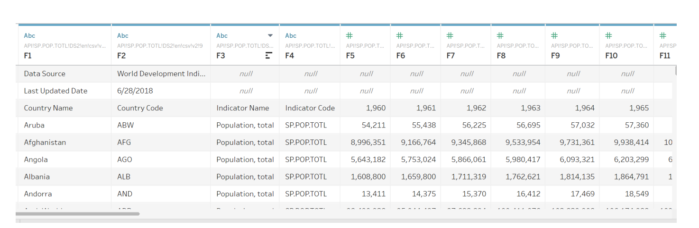

We should be able to see that there is a problem with the way Tableau interpreted the dataset.
There are some columns of the data that are not recognised (F1, F2, F3, etc.). Because you might not be able to
edit the original Excel data on Tableau, you need to make sure your data is clean before importing
it.

So, we need to clean up the data by deleting those null rows and columns in our original excel/csv file.

Q: Is there any faster way to clean up the datasets in TableAU?
A: Pivoting, filtering or using the tableau source page.

## Dimensions and Measures

[READ THIS ABOUT DIMENSIONS AND MEASURES](https://help.tableau.com/current/pro/desktop/en-us/datafields_typesandroles.htm)

### 🔷 Dimensions
- **Categorical** fields that describe "what" your data is about.
- Typically contain qualitative values like:
  - Names (e.g., Country, Product)
  - Dates (e.g., Year, Month)
  - Geographies (e.g., Region)
- Affect the **level of detail** in the view.
- Usually treated as **discrete (blue)** fields.

### 🔶 Measures
- **Quantitative** fields that can be **aggregated**.
- Typically contain numeric values:
  - Sales
  - Profit
  - Population
  - Quantity
- Usually **continuous (green)** fields that Tableau can:
  - Sum
  - Average
  - Count
  - etc.

Tableau identifies each field as a dimension or measure in the Data pane, depending on the type of data the field contains. You use these fields to build your analysis.

Data fields are made from the columns in your data source. Each field is automatically assigned a data type such as integer, string, or date, and a role: a discrete dimension or continuous measure (or less commonly, a continuous dimension or discrete measure).

Dimensions group or segment the data. Dimensions typically contain qualitative values (such as names, dates, or geographical data). You can use dimensions to categorize your data. Dimensions affect the level of detail in the view.

Measures are aggregated. Measures typically contain numeric, quantitative values that you can measure. When you drag a measure into the view, Tableau applies an aggregation on the field.
To learn more about aggregation, see List of Predefined Aggregations in Tableau and Aggregate Functions in Tableau.

So in summary: 
-Dimensions: Categorical fields that describe "what" your data is about. 
i.e.: names, dates, geographies, categories \
-Measures : Quantitative field that can be aggregated (summed, averaged) like Sales, Profit, Quantity, Discount, Population 

# 🟦 Blue and 🟩 Green Fields

- **Green (Continuous)**: Used for numeric axes and ranges (e.g., trends over time, scatter plots).
- **Blue (Discrete)**: Used for grouping/categorising data (e.g., labels, dimension filters, bar chart categories).

- Continuous means "forming an unbroken whole, without interruption". These fields are colored green. When a continuous field is put on the Rows or Columns shelf, an axis is created in the view.
- Discrete means "individually separate and distinct." These fields are colored blue. When a discrete field is put on the Rows or Columns shelf, a header is created in the view.

In the example on the left, because the Quantity field is Continuous, it creates a horizontal axis along the bottom of the view. The green field and the axis help you to see that it's a continuous field.

In the example on the right, the Quantity field is Discrete. It creates a horizontal headers instead of an axis. The blue field and the horizontal headers help you to see that it's discrete.

In both examples, the Sales field is set to Continuous. It creates a vertical axis because it's continuous and on the Rows shelf. If it was on the Columns shelf the axis would be horizontal. The SUM aggregation indicates that it's a measure.

The absence of an aggregation function in the Quantity field name indicates that it's a dimension.

# Dimensions in field of view
Often, fields from the Dimension area are discrete when you add them to a view, with a blue background. Date dimensions and numeric dimensions can be discrete or continuous, and all measures can be discrete or continuous.

When you drag a discrete dimension field to Rows or Columns, Tableau creates column or row headers.

## Dataset shape and reshaping

The shape of this dataset is not suitable for analysis: \
- Each year is treated as a separate column. \
- Tableau works best with long format data, where each row represents a single observation and years are values in a single column. \

Dataset reshaping: [Cleaning and Reshaping your datasets](https://www.tableau.com/learn/get-started/data-structure) \
Pivot data from Column to Rows: [Pivot data from Column to Rows:](https://help.tableau.com/current/pro/desktop/en-us/pivot.htm) \

## Measure Names and Measure Values

CNT(FIT3179_World_Population...)	Count of rows in the dataset. Tableau is auto-counting records. 
SUM(Population)	The total population (summed across your dimension, like year/country). 
SUM(Year)	The sum of the year values. Often not useful and can be misleading unless you’re counting events per year (usually we group by year, not sum it). 

These appear because Tableau includes all numeric fields (or aggregatable fields) in Measure Values unless you manually filter them using the Measure Names filter (which you already added on the left) 

NOTE: We dont actually have to use Measure Values! I think it is more intuitive to use the direct parameter variable like SUM(POPULATION) as it is more clearer.

## 🧭 Tableau Workspace Overview

### 🔠 Columns
- Drag **dimensions** or **measures** here to define the **X-axis** of your chart.
- Controls the **horizontal** layout or categories.

### 📏 Rows
- Drag fields here to define the **Y-axis**.
- Controls the **vertical** layout.

### 🎯 Marks Pane
- Controls the **visual encoding** of the data (i.e., how marks are represented).
- Components:
  - **Colour**: Apply color based on category or value
  - **Size**: Adjust mark size
  - **Label**: Show numeric or textual labels
  - **Detail**: Adds additional info to marks without changing chart structure
  - **Tooltip**: Display info when hovering

### 🔍 Filters
- Control **which data is included** in the view.
- Can be applied to dimensions or measures.
- Filters can be:
  - **Context Filters** (affect other filters)
  - **Top N Filters**
  - **Relative Date Filters**

### 🧲 Channels (aka Encoding Channels)
These are **visual encodings** that map your data to graphical elements. Common channels:
- **Position**: Most effective (used in scatter plots, bar charts)
- **Length**: Good for comparison (e.g., bar heights)
- **Color Hue**: Great for categorical data
- **Color Saturation**: Can represent intensity or numerical ranges
- **Size**: Can indicate magnitude, but harder to compare precisely
- **Shape**: Useful for distinguishing categories (less for quantity)
- **Text**: Often used for labels or tooltips

## What are the advantages of using a stacked bar chart in this scenario?
- A stacked bar chart clearly shows defined individual segments that represent each year and how all the individual segments contribute to
a total value (i.e. the population), so the entire stacked bar is the total population but we can observe the populations in each year for that country. 
- Shows how much each year contributes to the population 
- Saves space and becomes more compact 
- Easier for the human eye to intuitively compare total population across countries based on height 
- Easier to compared populations in specific years (i.e. If India's 2010 population is much larger than 2006, the stack shows that visually with a taller segment). 

## What are the disadvantages of using a stacked bar chart in this scenario?
- Be hard to read when you want to compare individual segments (e.g., compare only 2010 population across all countries). since they dont have the same "base point level" 
- Not great for showing trends over time 
- The reliance on COLOUR is needed. If the colorrs are too similar or the segments too small: it’s hard to tell them apart,  creates accessibility issues for color-blind users 

## When to use
“Which countries had the highest total population over multiple years?” 

“How much did each year contribute to a country’s total population?” 

“Did a country's population grow, shrink, or stay the same over time?” 

## TableAU warning message

This warning is telling you that you're about to add a field to a shelf (like Columns, Rows, or Color) that contains up to 263 distinct values, but Tableau recommends no more than 20 for optimal performance and readability.

Why it matters alot:
- Performance: too many members can slow down rendering and make the visualisation sluggish. 
- Charts with hundreds of categories (e.g., 263 countries or regions) can be hard to read and interpret. 
- Tableau tries to keep visualisations clean and effective, so it flags when you're likely to overwhelm the view. Clean visualisations are better for user experience and analysis. \
